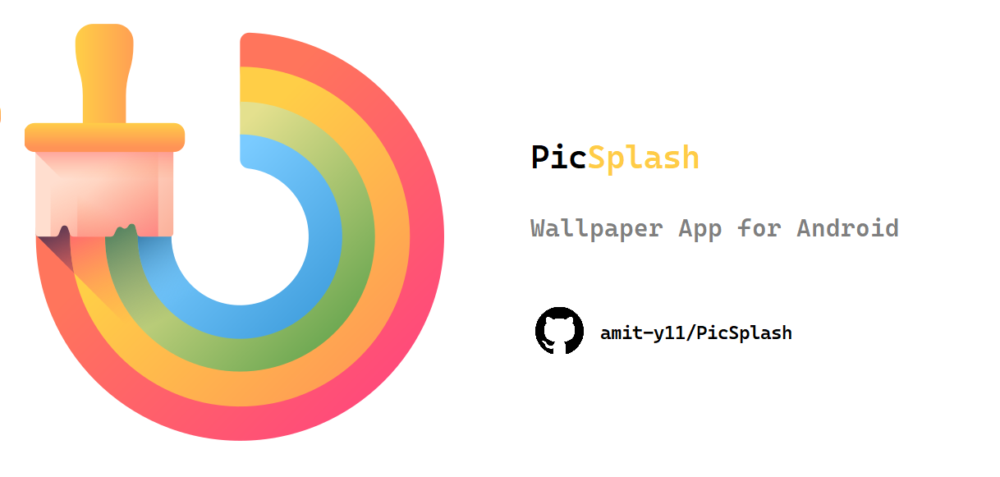
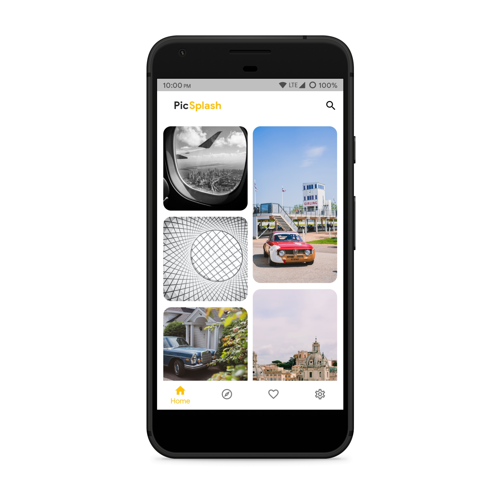
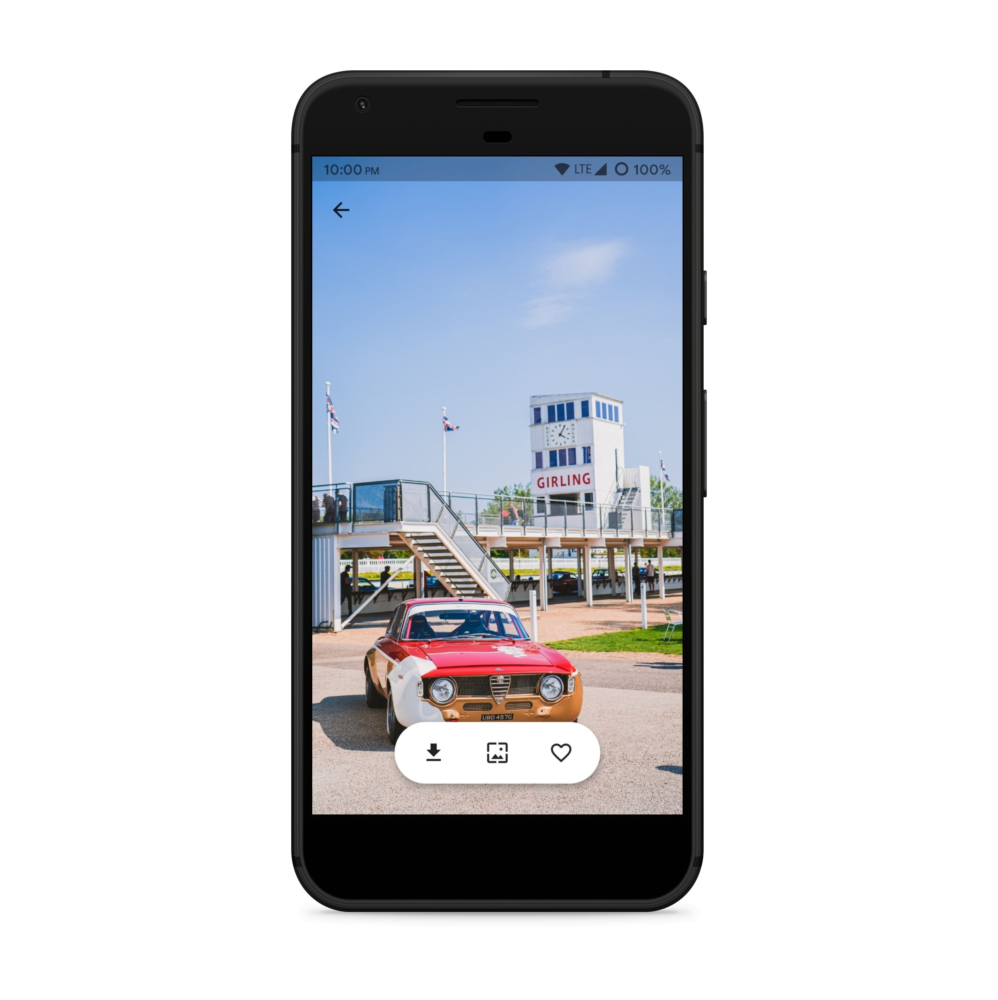
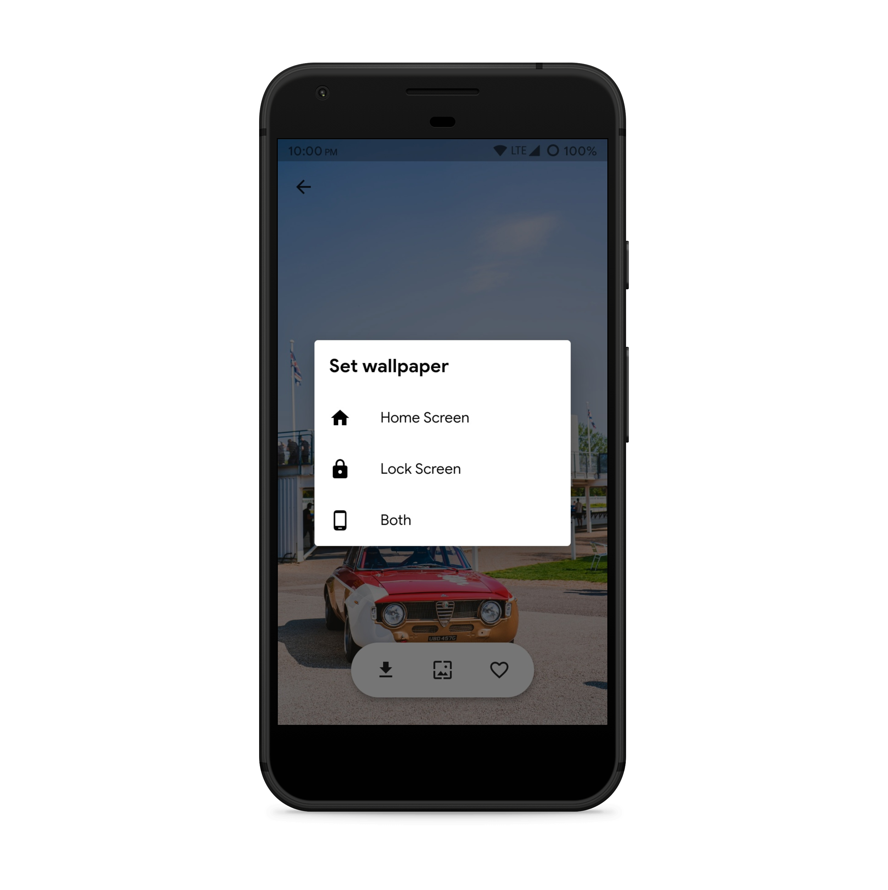
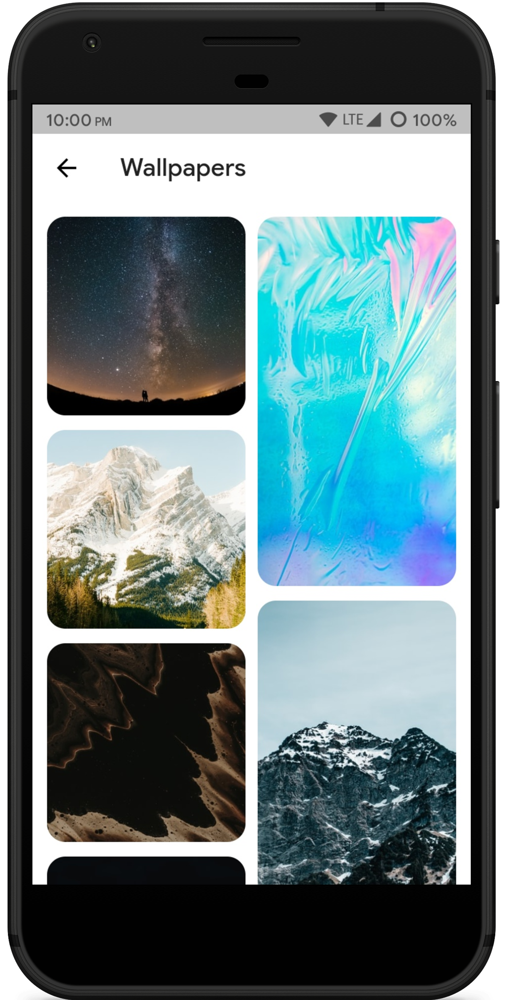
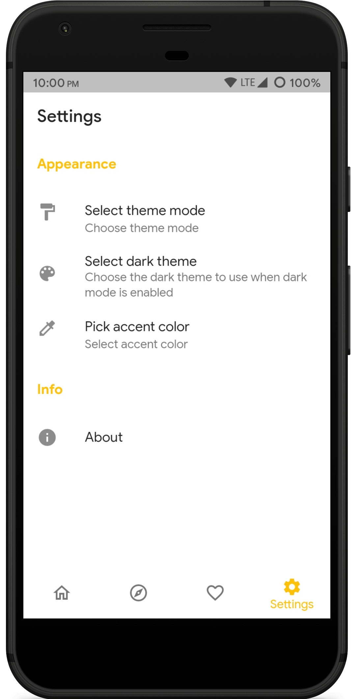

# PicSplash

# About
PicSplash is a wallpaper app for android made with flutter and Unsplash api. 
Features available:
* Set images as wallpaper
* Download and save images locally
* Dark theme
* Change accent colors
* Explore various categories of wallpaper
* Add images to favorites

# Screenshots
<table>
<tr>
    <td></td>
    <td></td>
    <td></td>
</tr>
<tr>
    <td></td>
    <td></td>
    <td></td>
</tr>

